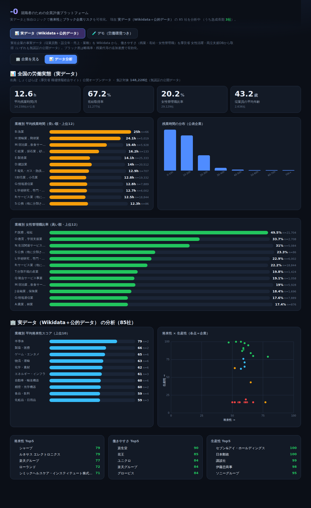
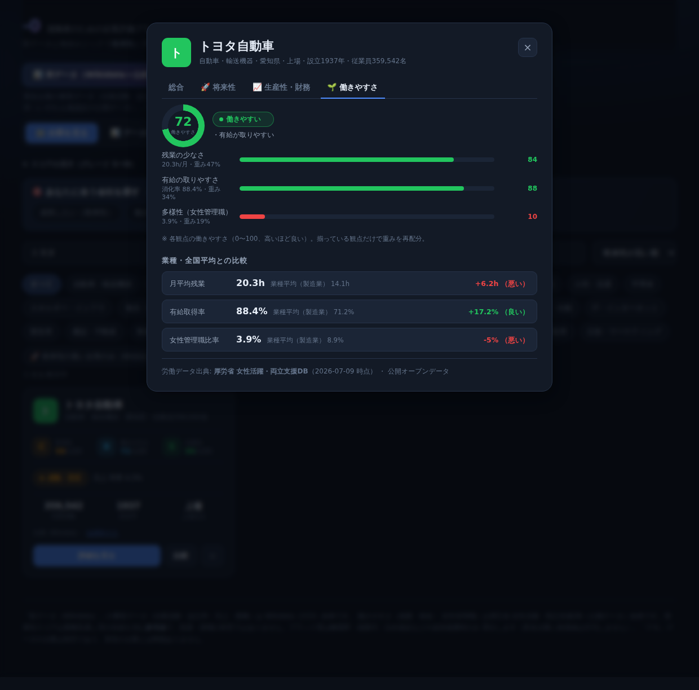
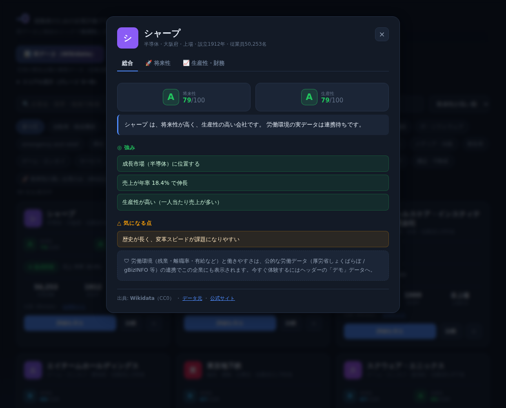
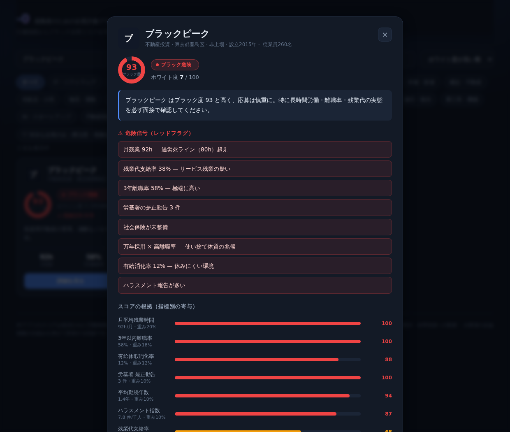

# -0（ゼロ） — 就職者のための企業評価プラットフォーム

就職者のために、企業の**将来性**と**ブラック企業リスク**を可視化する Web アプリです。
**実在企業の事実データ（Wikidata）** をベースに、スコアはブラックボックスにせず
**各指標の寄与を必ず開示**します。


## 5 つの分析軸

企業を多面的に評価します（データが揃う軸のみ表示）。

1. **🚀 将来性** — 従業員数・売上推移・設立年・上場・業種から「将来性スコア」と成長ステージ
2. **📈 生産性** — 一人当たり売上高・営業利益・営業利益率（実データで算出）
3. **💹 株・投資** — 売上・純利益・純利益率・時価総額・上場市場など財務スナップショット（参考値）
4. **🌱 働きやすさ** — 残業の少なさ・有給・定着・勤続・多様性からワークライフ重視のスコア
5. **🛡 ブラック度** — 労働指標から危険度を算出し、危険な企業を警告

## 📊 データ分析ダッシュボード

「データ分析」ビューでは、**全国 約15万社の実データ**（しょくばらぼ 公開オープンデータ）を集計した
労働実態と、掲載企業群の分析を可視化します。すべて無認証の実データです。

- 全国サマリー（平均残業 12.6h／有給取得率 67.2%／女性管理職 20.2%／平均年齢 43.2）
- 業種別 平均残業時間ランキング（漁業・運輸・宿泊飲食が上位）／残業時間の分布
- 業種別 女性管理職比率（医療・福祉が最高）
- **都道府県別ランキング**（残業／有給／女性管理職を切替）
- 掲載企業の業種別平均将来性、**将来性 × 生産性の散布図**、各軸 Top5



### 業種・全国平均との比較（各社詳細）

実労働データがある企業は、詳細の「働きやすさ」タブで**業種平均・全国平均との差**と
**業種内パーセンタイル**（分位点から算出）を表示します。
例：トヨタ自動車は残業 20.3h（製造業平均 14.1h → +6.2h／業種内で19%の企業より少ない）、
有給 88.4%（平均 71.2% → +17.2%／業種内で89%の企業より高い）。



## 💎 隠れ優良企業の発掘

規模（知名度の代理指標）は控えめでも、将来性・働きやすさ・安全度・生産性が
そろって高い企業を客観指標で抽出します（`src/engine/gems.ts`）。名前で判断しがちな
ミスマッチを防ぐための機能です。一覧の「💎 隠れ優良企業のみ」で絞り込め、
データ分析ビューには理由つきのハイライトカードを表示します。

## 🎯 相性診断（あなたへの適正な評価）

「成長したい」「働きやすさ重視」「ブラックを避けたい」「稼ぐ力」「規模の安定」から
**重視することを選ぶ**と、その優先度で各社の**マッチ度（%）**を算出し、あなた向けに並び替えます。
**求職者ペルソナ**（🌱ワークライフ重視／🚀成長・キャリア志向／🛡安定志向／💰しっかり稼ぎたい）を
ワンタップで適用することもできます。データが無い軸はその企業では除外して平均するため公平です
（`src/engine/fit.ts`）。選べる軸・ペルソナはデータセットに応じて自動調整されます。


## 見やすさ（人間中心のUI）

- **グレード表示（S / A / B / C / D）** — 数値だけでなく一目でわかる評価。すべて「高い＝良い」向きに統一。
- **総合タブ** — 詳細画面は総合／将来性／生産性・財務／働きやすさ／リスクのタブ構成。まず
  **平易な一言コメント**（例:「将来性が高く、働きやすい会社です」）と強み・気になる点を要約表示。
- **スコアの見方（凡例）** — 各軸の意味とグレードの基準をいつでも確認可能。
- **キーボード操作** — 詳細・比較は Esc で閉じる。モバイル幅にも対応。



## 実データ化（Wikidata）

- 日本の**実在企業の事実データ**を Wikidata SPARQL（無認証・CC0）から取得。
  取得パイプラインは [`scripts/fetch-companies.mjs`](scripts/fetch-companies.mjs)。
  従業員数・売上高は**複数年の推移**を保持し、成長率（CAGR）算出に使用。
- ヘッダーで「**実データ（Wikidata）**」と「**デモ（労働環境つき）**」を切替可能。
- **労働データの扱い**: Wikidata に労働指標は無い。実名企業に推測値を付与すると
  名誉毀損リスクがあるため、実データ企業には労働指標を付与せず「未連携」とし、
  公的労働データ（厚労省しょくばらぼ / gBizINFO 等）の連携時のみブラック度を算出する。
  ブラック度評価は**デモデータ**でフルに体験できる。

```bash
node scripts/fetch-companies.mjs   # Wikidata から実データを再取得
```

### 実労働データの連携

**働きやすさ（残業・有給・女性管理職）は、トークン不要の公開データで連携済み。**
厚労省「女性活躍・両立支援DB」のオープンデータCSVを法人番号で突合し、実名企業に実データで表示します。

```bash
node scripts/enrich-positive-db.mjs   # 両立支援DB(無認証)から働きやすさを連携（実名企業に反映）
node scripts/enrich-shokuba.mjs       # しょくばらぼ全データ(無認証・約15万社)を集計＋残業/有給を補完
```

`enrich-shokuba.mjs` は約15万社の公開データを集計して `analytics.generated.json`（データ分析ビュー用）を
生成しつつ、法人番号で自社データの残業・有給を補完します。いずれもトークン不要。


ブラック度（離職率・残業代・法令違反）や平均年収など、追加データは以下で拡張できます（詳細は
[`src/data/sources/README.md`](src/data/sources/README.md)）。しょくばらぼの一括CSVは無認証、
gBizINFO / EDINET のみ無料トークンが必要です。

```bash
cp .env.example .env                 # gBizINFO / しょくばらぼ(CSV) / EDINET を設定
node scripts/enrich-labor.mjs        # 設定した分だけ追記（未設定なら no-op）
```

| ソース | 取得データ | 認証 |
| --- | --- | --- |
| 女性活躍・両立支援DB（厚労省） | **月平均残業・有給取得率・女性管理職比率** | **不要（公開データ）** |
| しょくばらぼ（厚労省） | 平均残業時間・有給取得率・離職率 | 一括CSV（無償） |
| gBizINFO（経産省） | 平均勤続年数・女性管理職比率 ほか | 無料トークン |
| EDINET（金融庁） | 平均年間給与・平均勤続年数（上場） | 無料APIキー |

## 主な機能

- **多面スコア** — 将来性・生産性・株/投資・働きやすさ・ブラック度を1画面に集約
- **将来性＆成長ステージ** — 売上・従業員の推移をスパークラインで可視化
- **生産性・財務スナップショット** — 一人当たり売上、純利益率、時価総額などを実データで表示
- **ブラック度スコア（0–100）** — 9 指標を重み付け、危険信号（レッドフラグ）を警告
- **スコアの根拠を開示** — 各要因のポテンシャル／リスクポイントと重みを可視化
- **多軸レーダー** — 詳細の「総合」タブに単体プロフィール、比較では最大4社を重ねて可視化（配色は CVD 検証済み）
- **企業比較** — 最大 4 社を並べて比較（レーダー＋表。将来性・生産性・働きやすさ・ブラック度の最良値をハイライト）
- **検索・絞り込み・並び替え** — 将来性／生産性／働きやすさ順、「将来性の高い企業のみ」「安全な企業のみ」
- **お気に入り** — localStorage に保存（サーバー不要）


## ブラック企業スコアリング

| 指標 | 重み | 考え方 |
| --- | --- | --- |
| 月平均残業時間 | 20% | 45h 超で警告、80h 超で過労死ライン |
| 3年以内離職率 | 18% | 高いほど定着せず実態が悪い |
| 有給休暇消化率 | 12% | 低いほど休めない |
| 残業代支給率 | 12% | 低い＝サービス残業の疑い |
| 平均勤続年数 | 10% | 短い＝使い捨て傾向 |
| ハラスメント指数 | 10% | 従業員あたりの報告件数 |
| 労基署 是正勧告 | 10% | 直近 5 年の法令違反歴 |
| 万年採用 | 4% | 常時大量採用は高離職の兆候 |
| 社会保険 完備 | 4% | 未整備は基礎的な問題 |

各指標を「リスクポイント 0–100（高いほど悪い）」へ正規化し、重み付き平均で
**ブラック度スコア**を出します。ホワイト度 = 100 − ブラック度。ロジックは
`src/engine/scoring.ts` にあり、`src/engine/scoring.test.ts` でテスト済みです。

危険な企業は、根拠となる危険信号とスコアの内訳を明示して警告します。



## 将来性スコアリング

`src/engine/growth.ts`。実データから各要因を「ポテンシャル 0–100（高いほど有望）」に
正規化し、動的に再正規化した重みで平均します（データ欠損の要因は除外）。

| 要因 | 基準重み | 入力 |
| --- | --- | --- |
| 業種の将来性 | 30% | 業種アウトルック表（`industry.ts`・編集可能） |
| 売上成長率 | 24% | 売上高 CAGR（単位不整合の外れ値を除外） |
| 従業員数の成長 | 14% | 従業員数 CAGR |
| 成長ステージ | 14% | 企業年齢（設立年） |
| 事業規模の安定性 | 8% | 従業員数 |
| 資本アクセス | 10% | 上場の有無 |

実データ（Wikidata の売上・従業員推移）から成長率を計算し、根拠を開示します。


### リスク区分

| ブラック度 | 区分 |
| --- | --- |
| 0–24 | 優良（ホワイト） |
| 25–44 | 標準 |
| 45–64 | 要注意 |
| 65–100 | ブラック危険 |

## 技術構成

- Vite + React + TypeScript
- スタイルは自前の CSS デザインシステム（依存最小・ビルド安定）
- Vitest（各評価エンジンのユニットテスト 38 件）
- 実データ: Wikidata SPARQL（`scripts/fetch-companies.mjs` → `companies.generated.json`）
- データ層を分離（`src/data/index.ts`）。実データ／デモを切替でき、将来 API / DB / ユーザー投稿へ拡張可能

## 開発

```bash
npm install
npm run dev       # 開発サーバー
npm test          # スコアリングエンジンのテスト
npm run build     # 型チェック + 本番ビルド
npm run preview   # 本番ビルドのプレビュー
```

## ロードマップ

計画の詳細は [`docs/PLAN.md`](docs/PLAN.md) を参照。

1. 公的労働データ連携（厚労省しょくばらぼ / gBizINFO / EDINET）で実名企業のブラック度も算出
2. 厚労省「労働基準関係法令違反に係る公表事案」を根拠にした証拠ベースの警告
3. ユーザー投稿型の口コミ・実残業時間の収集と集計
4. バックエンド API + DB 化、地域・職種別の統計
5. モバイルアプリ（同エンジンを再利用）

## 注意

本アプリのスコアは提供された労働指標に基づく**参考値**です。掲載企業はすべて
**架空**であり、実在の企業・団体とは一切関係ありません。実データを導入する際は、
出典の明示・名誉毀損への配慮・企業側の反論掲載の仕組みを併せて実装する前提です。
