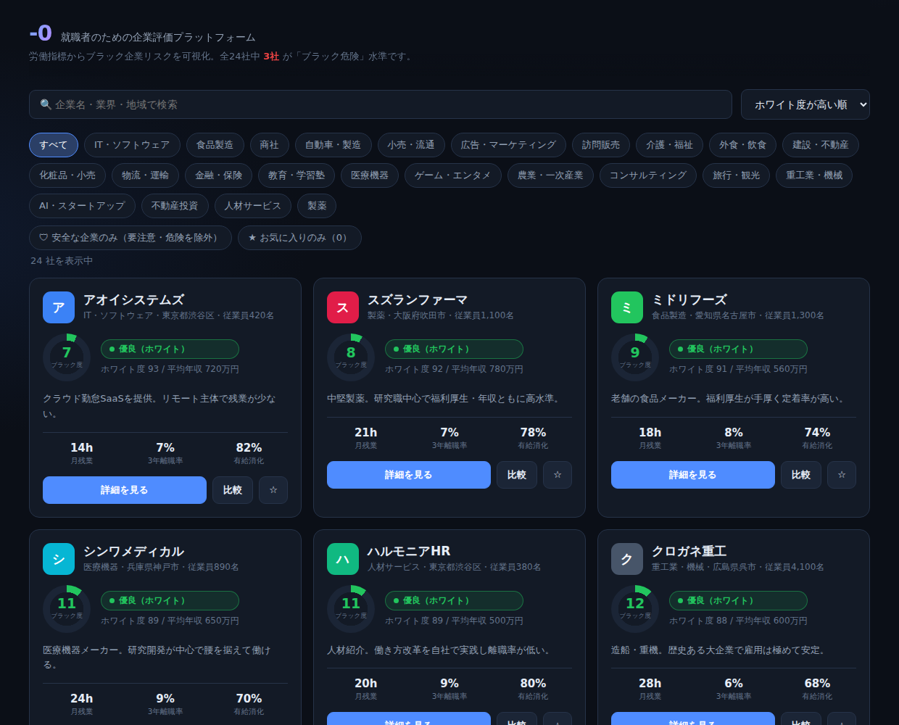

# -0（ゼロ） — 就職者のための企業評価プラットフォーム

労働指標から**ブラック企業リスクを可視化**し、就職者が実態の見えない企業に
「入ってしまう」前に気づけるようにするための Web アプリです。

スコアはブラックボックスにせず、**各指標の寄与を必ず開示**します。



## 主な機能

- **ブラック度スコア（0–100）** — 9 つの労働指標を重み付けして算出。4 段階のリスク区分で表示
- **危険信号（レッドフラグ）** — 過労死ライン超え・サービス残業・高離職率・労基署是正勧告などを明示的に警告
- **適正評価** — 良い点・懸念点・就職者向けの総合所見をバランスよく提示
- **スコアの根拠を開示** — 指標ごとのリスクポイントと重みを可視化
- **企業比較** — 最大 4 社を並べて比較（最良値をハイライト）
- **検索・絞り込み・並び替え** — 業界／地域／キーワード、「安全な企業のみ」表示、各種ソート
- **お気に入り** — localStorage に保存（サーバー不要）

## ブラック企業スコアリング

| 指標 | 重み | 考え方 |
| --- | --- | --- |
| 月平均残業時間 | 20% | 45h 超で警告、80h 超で過労死ライン |
| 3年以内離職率 | 18% | 高いほど定着せず実態が悪い |
| 有給休暇消化率 | 12% | 低いほど休めない |
| 残業代支給率 | 12% | 低い＝サービス残業の疑い |
| 平均勤続年数 | 10% | 短い＝使い捨て傾向 |
| ハラスメント指数 | 10% | 従業員あたりの報告件数 |
| 労基署 是正勧告 | 10% | 直近 5 年の法令違反歴 |
| 万年採用 | 4% | 常時大量採用は高離職の兆候 |
| 社会保険 完備 | 4% | 未整備は基礎的な問題 |

各指標を「リスクポイント 0–100（高いほど悪い）」へ正規化し、重み付き平均で
**ブラック度スコア**を出します。ホワイト度 = 100 − ブラック度。ロジックは
`src/engine/scoring.ts` にあり、`src/engine/scoring.test.ts` でテスト済みです。

危険な企業は、根拠となる危険信号とスコアの内訳を明示して警告します。


### リスク区分

| ブラック度 | 区分 |
| --- | --- |
| 0–24 | 優良（ホワイト） |
| 25–44 | 標準 |
| 45–64 | 要注意 |
| 65–100 | ブラック危険 |

## 技術構成

- Vite + React + TypeScript
- スタイルは自前の CSS デザインシステム（依存最小・ビルド安定）
- Vitest（スコアリングエンジンのユニットテスト）
- データは `src/data/companies.ts` のシード（架空企業）。データ層を分離しており、
  将来 API / DB / ユーザー投稿へ差し替え可能

## 開発

```bash
npm install
npm run dev       # 開発サーバー
npm test          # スコアリングエンジンのテスト
npm run build     # 型チェック + 本番ビルド
npm run preview   # 本番ビルドのプレビュー
```

## ロードマップ

計画の詳細は [`docs/PLAN.md`](docs/PLAN.md) を参照。

1. ユーザー投稿型の口コミ・実残業時間の収集と集計
2. 認証・企業側の情報開示（公式データ連携）
3. バックエンド API + DB 化、地域・職種別の統計
4. 通報・モデレーション、根拠付き反論の掲載
5. モバイルアプリ（同エンジンを再利用）

## 注意

本アプリのスコアは提供された労働指標に基づく**参考値**です。掲載企業はすべて
**架空**であり、実在の企業・団体とは一切関係ありません。実データを導入する際は、
出典の明示・名誉毀損への配慮・企業側の反論掲載の仕組みを併せて実装する前提です。
